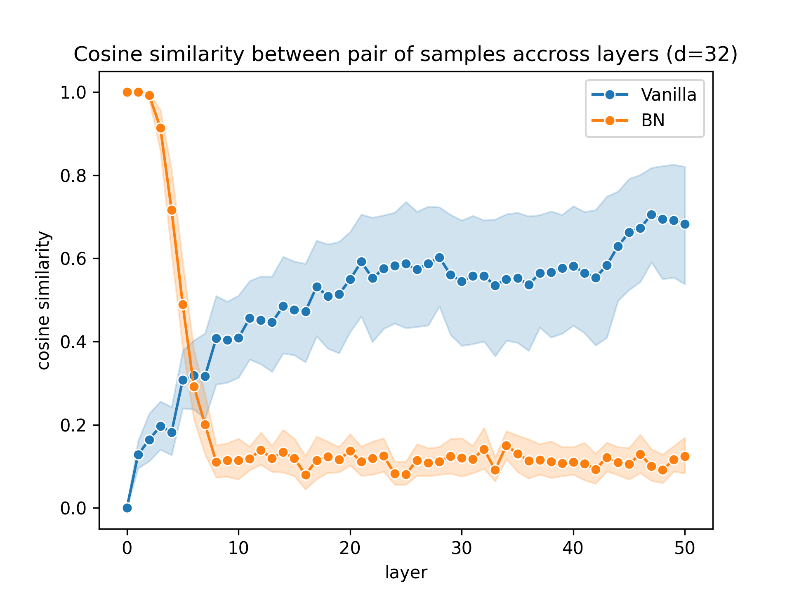
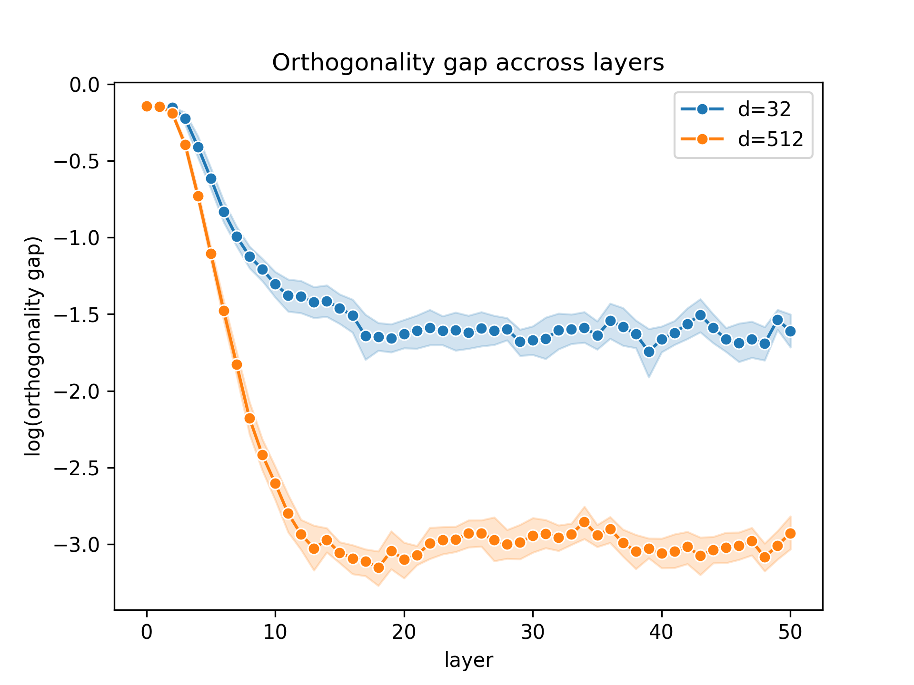
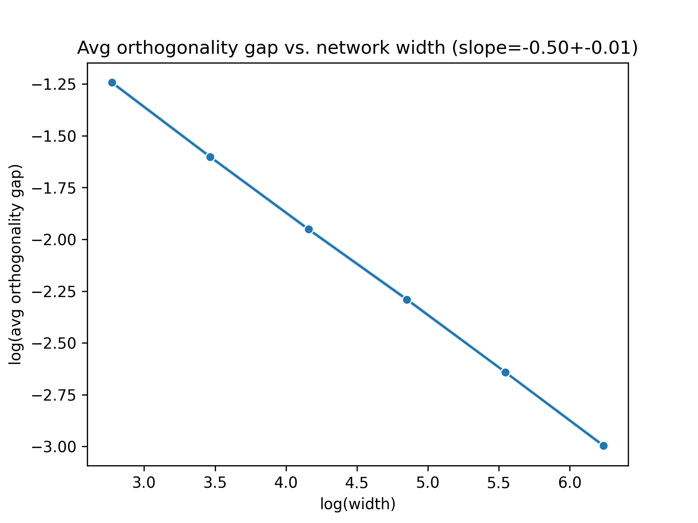
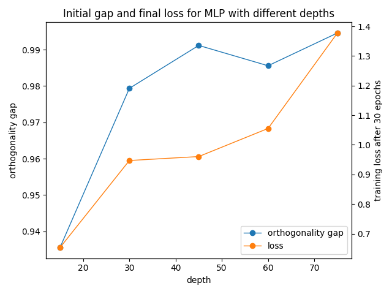
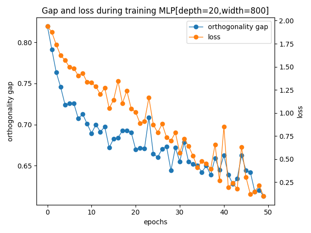
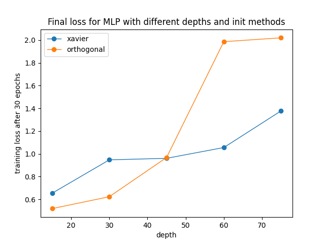

# Experiments with Batch Normalization in Neural Networks

* Implement the experiments described in [Batch Normalization Orthogonalizes Representations in Deep Random Networks](https://arxiv.org/pdf/2106.03970.pdf)
* Compare and discuss the results with the original article

### Results

*Reproduction of figure 1*

*Reproduction of figure 2a*

*Reproduction of figure 2b*

*Reproduction of figure 3a (single run)*

*Reproduction of figure 3b (single run)*

*Reproduction of figure 4 (single run)*