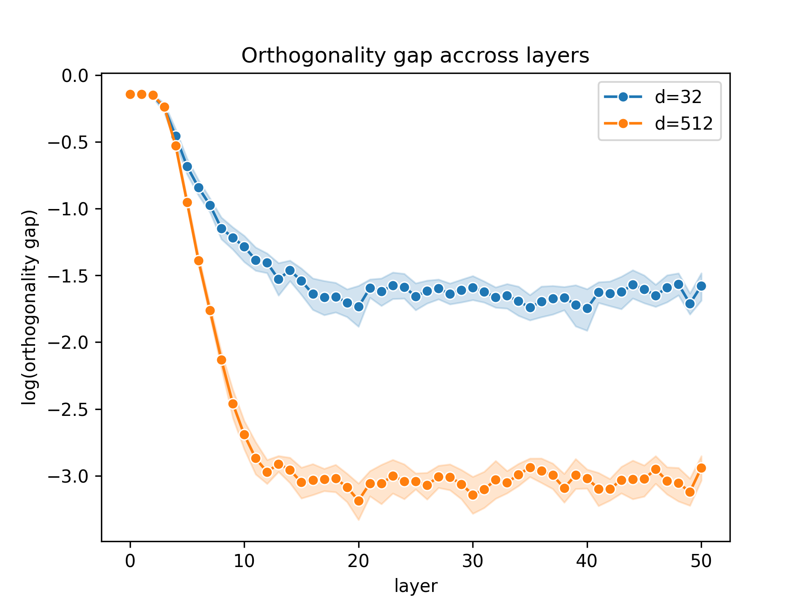

# Experiments with Batch Normalization in Neural Networks

Implementation of most of the experiments described in paper: [Batch Normalization Orthogonalizes Representations in Deep Random Networks](https://arxiv.org/pdf/2106.03970.pdf) written by *Daneshmand et al.*

The code is organized as follows:

* `orthogonality_deep_representations.py` implements the experimentations presented in section 3 of the paper.

* `orthogonality_optimization.py` implements the experimentations presented in section 5 of the paper.

* `figures` contains the plots obtained after running the previous code and are presented below.

### Results

*Reproduction of figure 1*

*Reproduction of figure 2a*

*Reproduction of figure 2b*

*Reproduction of figure 3a (single run)*

*Reproduction of figure 3b (single run)*

*Reproduction of figure 4 (single run)*

*Reproduction of figure 2b (with ReLU activation)*

*Reproduction of figure 2b (with sigmoid activation)*

*Reproduction of figure 2b (with sinus activation)*

*Reproduction of figure 2b (with tanh activation)*